# 🍋 Lemon Django — Подписки через Lemon Squeezy

Интеграция подписок в Django-проект с помощью Lemon Squeezy.

## ⚙️ Требования

- Python 3.9+
- учётная запись ngrok
- учётная запись Lemon Squeezy с созданным Store, Product и Variant
- REST Client в VS Code


## ⚙️ Переменные окружения `.env`

Создайте файл `.env` в корне проекта со следующим содержимым (для примера можете взять `.env_example`):

```env
# Lemon Squeezy API
LEMON_API_KEY=sk_...            # Ваш Secret API Key
LEMON_STORE_ID=...              # ID вашего магазина
LEMON_PRODUCT_ID=...            # ID вашего продукта
LEMON_VARIANT_ID=...            # ID подписочного варианта
LEMON_WEBHOOK_SECRET=...        # Signing secret из настроек Webhook

# Прочее
LEMON_BASE_URL=https://api.lemonsqueezy.com/v1
SITE_DOMAIN=http://localhost:8000

# Ngrok
NGROK_TOKEN=токен из https://ngrok.com/
```


## 📦 Установка и запуск

```bash
git clone https://github.com/belyashnikovatn/lemon_django.git
docker compose up --build
```

## 🌐 Тестирование через HTTP-запросы

Используйте файл `lemon_test.http` для тестирования:

```http
### 🆕 Регистрация пользователя
POST http://localhost:8000/api/register/
Content-Type: application/json

{
  "username": "bun",
  "email": "bun@example.com",
  "password": "bun123"
}

### 🔑 Получение токена
POST http://localhost:8000/api/login/
Content-Type: application/json

{
  "username": "bun",
  "password": "bun123"
}

### 🧾 Создание checkout
# Вставьте access_token после получения
POST http://localhost:8000/api/create_checkout/
Authorization: Bearer <access_token>
Content-Type: application/json

{}

### 👤 Проверка подписки
GET http://localhost:8000/api/subscription_status/
Authorization: Bearer <access_token>

### 💎 Доступ к премиум-контенту
GET http://localhost:8000/api/premium_content/
Authorization: Bearer <access_token>
```

## 🧪 Тестирование Webhook

1. При запуске проекта через докер вы увидите примерно такую строчку:
   ```bash
    ngrok       | � Public ngrok URL: https://1627-185-88-142-28.ngrok-free.app
   ```
2. Настройте Webhook в Lemon Squeezy:
   - URL: `https://1627-185-88-142-28.ngrok-free.app/api/lemon_webhook/`
   - События: `subscription_created`, `subscription_cancelled`, `subscription_resumed`, `subscription_expired`

## 🧠 Как это работает

- Пользователь регистрируется / логинится
- Создаёт checkout через Lemon Squeezy
- После оплаты вызывается вебхук → подписка активируется (как и при других настроенных событиях)
- Проверка подписки через permission
- Защищённый премиум-контент доступен только активным подписчикам

## Подробный сценарий тестирования
1. 🚀 Запустите проект. Скопируйте строку, сфромированную с помощью ngrok  
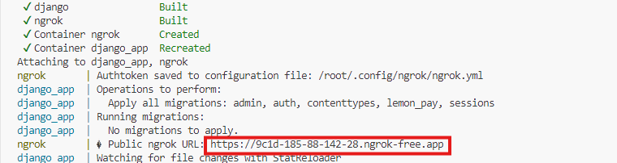

2. ⚙️ В личном кабинете Lemon Squeeze в настройках Webhooks измените строку для callback  
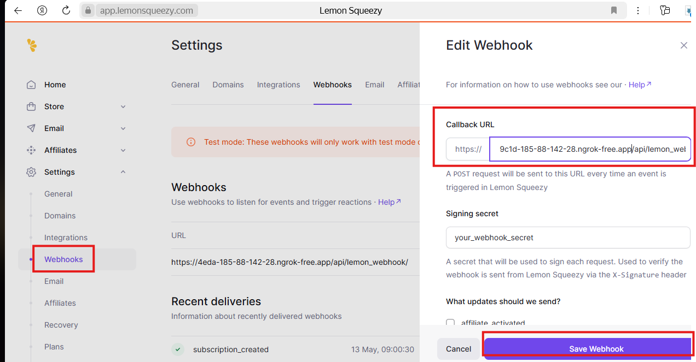

3. 👤 Создайте нового пользователя. Убедитесь, что статуст ответа 201  
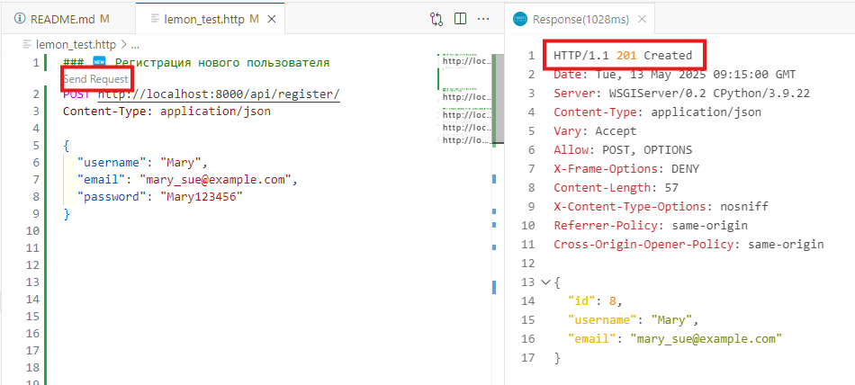

4. 🔑 Получите токен, скопируйте его. Вставляйте его во все последующие запросы  
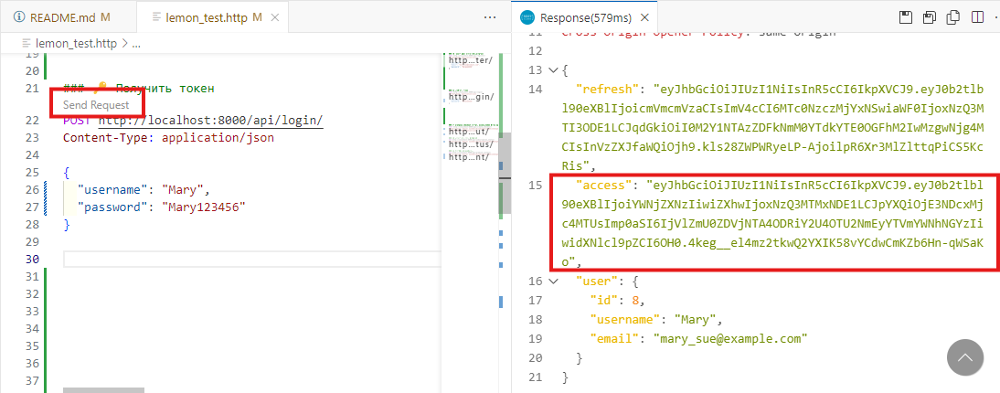

5. 💎 Запросите контент, который доступен только по подписке  
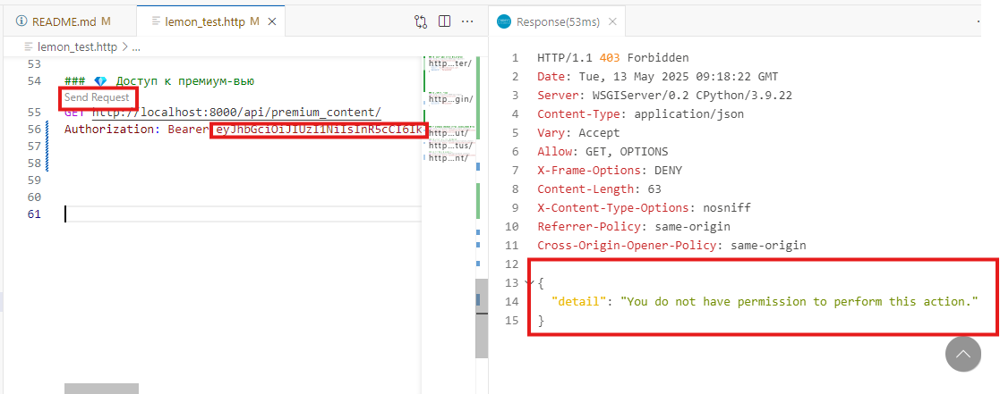

6. 🔍 Запросите статус подписки  
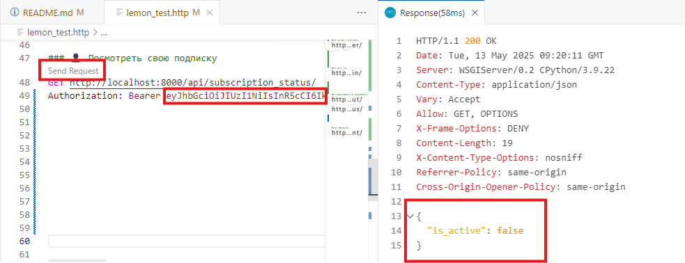

7. 🛒 Оформите заказ на подписку. Перейдите по ссылке на оплату  
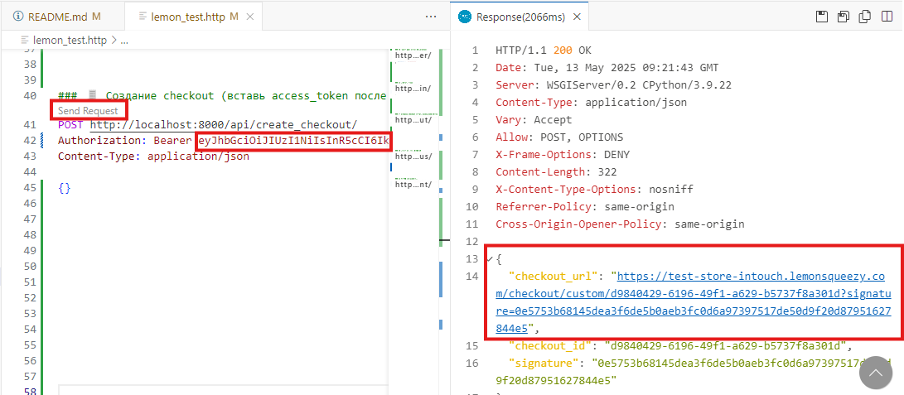

8. 💳 Обязательно заполните поля:
- Card number 4242 4242 4242 4242
- Expiration date больше текущей 
- Security code любой 
- Cardholder name любое 
- Billing address любой, но лучше как на скриншоте, чтобы меньше заполнять. Нажмите Pay  
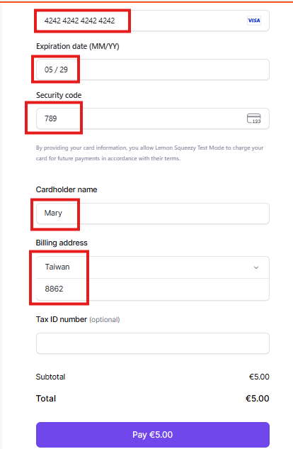

9. ✅ Появится сообщение об успешной оплате. Нажмите Continue, и вы попадёте на страницу приложения с шаблоном об успешной оплате. Закройте страницу.  
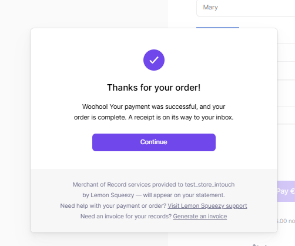
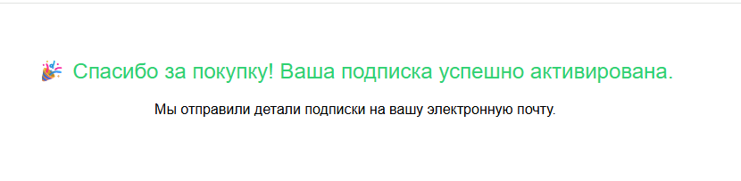


10. 📊 В личном кабинете Lemon Squeeze убедитесь, что вебхук отправил сообщение с событием subscription_created  
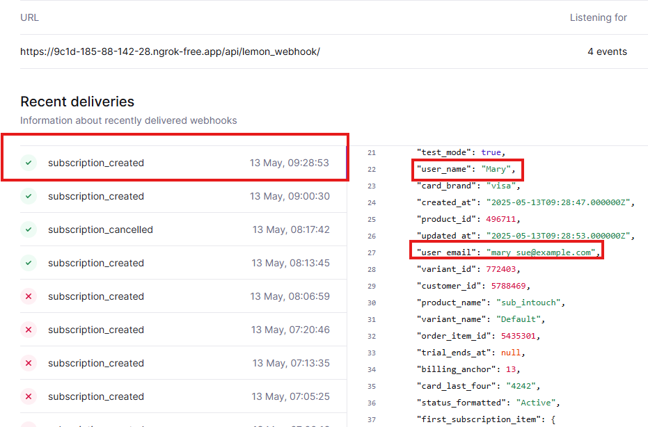

11. 🔍 Запросите статус подписки  
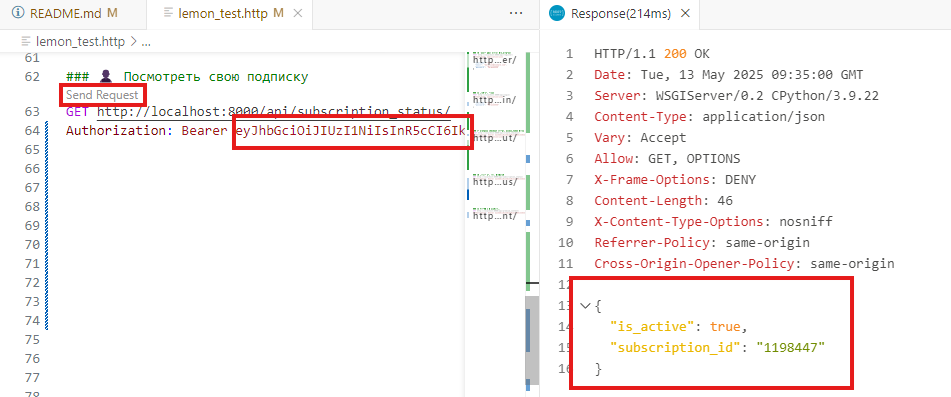


12. 💎 Запросите контент, который доступен только по подписке  
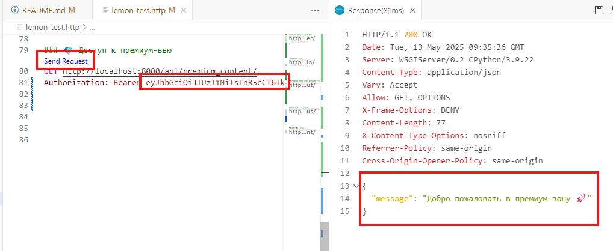

13. ❌ В личном кабинете Lemon Squeeze отмените подписку пользователя  
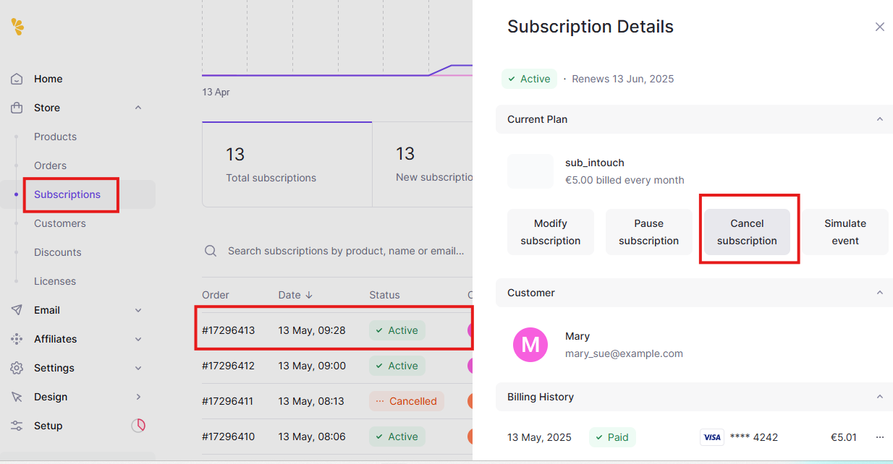

14. 📊 В личном кабинете Lemon Squeeze убедитесь, что вебхук отправил сообщение с событием subscription_cancelled  
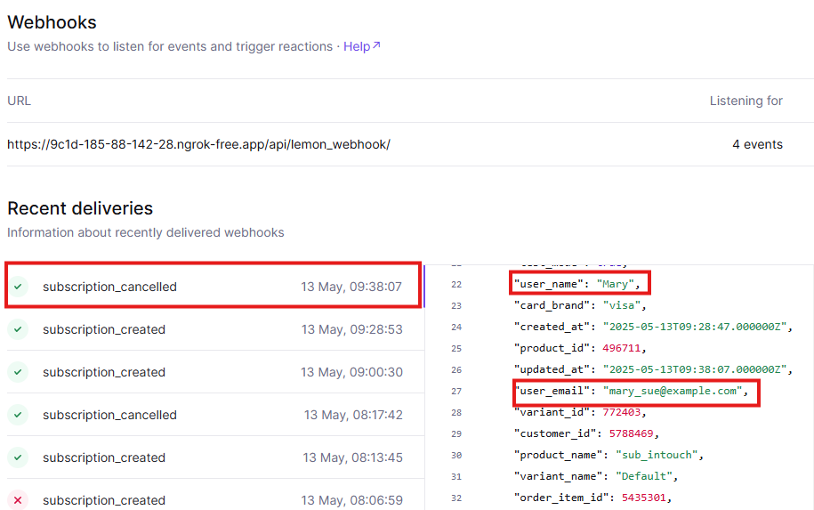

15. 💎 Запросите контент, который доступен только по подписке  


## 🛠️ Поддержка

Если у вас возникают ошибки, проверьте:

- Корректность `LEMON_API_KEY`, `LEMON_VARIANT_ID`, `LEMON_PRODUCT_ID`, `LEMON_STORE_ID`
- Доступность webhook по публичному HTTPS-URL
- Ответы API в логах

## 🔗 Полезные ссылки

- [Lemon Squeezy API Docs](https://docs.lemonsqueezy.com/api)
- [JWT + DRF](https://django-rest-framework-simplejwt.readthedocs.io/)
- [ngrok](https://ngrok.com/)

## 📝 TODO

- [ ] Поддержка нескольких вариантов/планов
- [ ] Отмена подписки пользователем
- [ ] Усложнение логики при подписке (Free period)


## 👩‍💻 Автор

[Таня Беляшникова](https://github.com/belyashnikovatn)
